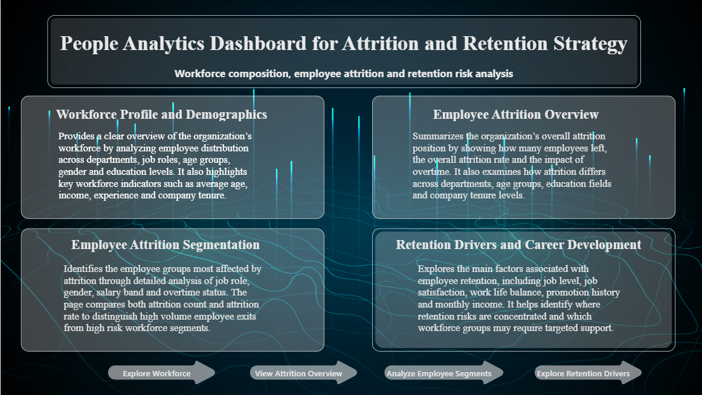
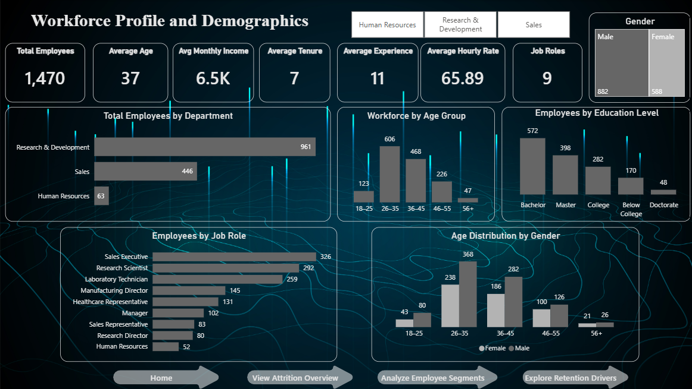
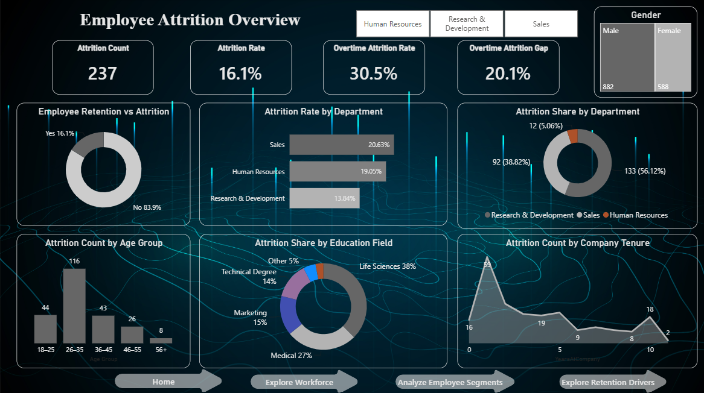
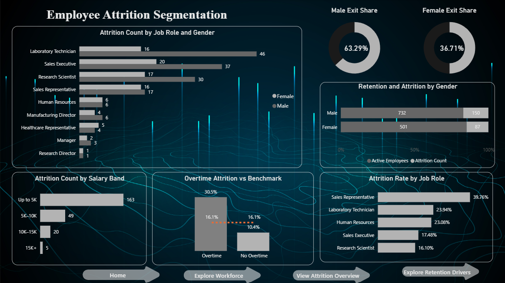
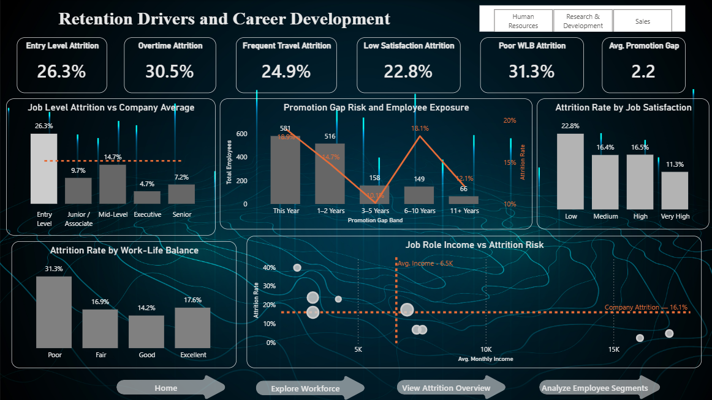

# People Analytics Dashboard for Attrition and Retention Strategy

An executive Power BI people analytics solution designed to help HR and business leaders understand workforce composition, identify employee groups with elevated attrition and examine workplace and career factors associated with employee retention.

The project moves beyond reporting how many employees left. It shows where attrition is concentrated, how many employees are exposed to each risk area and which workforce segments may require deeper investigation or targeted retention support.

---

## Executive Summary

The organisation has:

- **1,470 total employees**
- **1,233 active employees**
- **237 employee exits**
- **16.12% overall attrition**
- **36.9 average employee age**
- **6,503 average monthly income**
- **7.0 average years at the company**
- **28.3% of employees working overtime**

The analysis found that attrition is not evenly distributed across the workforce.

Sales Representatives recorded the highest Job Role attrition rate, while Laboratory Technicians contributed the highest exit volume. Overtime employees experienced substantially higher attrition than non-overtime employees. Entry level employees, employees reporting poor work-life balance and some employee groups with promotion gaps also showed elevated attrition.

The dashboard helps distinguish between:

- groups with a high attrition rate
- groups contributing a high number of exits
- groups with high employee exposure
- groups that may require further HR investigation.

---

## Business Problem

Employee attrition can increase recruitment and onboarding costs, disrupt team performance, reduce organisational knowledge and create additional workload for remaining employees.

Organisations may know their overall attrition rate but still lack visibility into:

- which departments and job roles face the greatest retention risk
- which employee groups contribute the highest number of exits
- how overtime, income, job level and satisfaction relate to attrition
- whether promotion timing is associated with retention
- which workforce groups should be prioritised for further review.

The purpose of this project is to convert employee level HR data into a structured decisionsupport solution for workforce planning and retention analysis.

---

## Key Business Questions

The dashboard was designed to answer:

1. What is the organisation’s overall attrition rate?
2. Which departments have the highest attrition rate?
3. Which departments contribute the largest share of employee exits?
4. Which job roles show the greatest attrition risk?
5. Which job roles contribute the highest number of exits?
6. How is overtime associated with employee attrition?
7. Which salary bands and job levels show elevated attrition?
8. How do job satisfaction and work-life balance relate to attrition?
9. Is promotion timing associated with employee retention?
10. Which workforce groups combine high risk with high employee exposure?
11. Where should HR teams focus further investigation?

---

## Stakeholders

The solution is designed for:

- HR leadership
- HR business partners
- Workforce Planning teams
- Department leaders
- People managers
- Talent and retention teams
- Executive leadership

---

## Project Scope

### Domain

- People Analytics
- Human Resources
- Workforce Planning
- Employee Retention

### Project Type

- Business Intelligence
- HR Analytics
- Attrition Analysis
- Retention Strategy

### Tools

- Power BI
- Power Query
- DAX
- Data Modelling

### Analytical Methods

- KPI design
- Employee segmentation
- Benchmark comparison
- Rate and volume analysis
- Interactive dashboarding
- Business interpretation
- Workforce prioritisation

---

## Data Overview

The project uses an employee level HR dataset containing **1,470 records**.

Each row represents an individual employee.

The data includes:

1. age and gender
2. department and job role
3. job level
4. monthly income
5. overtime status
6. business travel
7. job satisfaction
8. work-life balance
9. company tenure
10. total working experience
11. years since last promotion
12. attrition status.

### Data Granularity

The dashboard supports analysis at:

- Employee level
- Department level
- Job Role level
- Gender level
- Salary-band level
- Job-level group
- Age group
- Tenure group
- Promotion-gap group.

---

## ETL and Data Preparation

The dataset was prepared using Power Query and Power BI calculated columns.

The preparation process included:

- Importing the raw dataset
- Loading the dataset
- Checking and correcting data types
- Reviewing missing values and duplicate records
- Retaining `EmployeeNumber` as the unique employee identifier
- Removing constant fields that did not contribute to the analysis
- Validating employee and attrition totals
- Creating analytical segmentation bands
- Defining custom sort columns
- Preparing fields for interactive filtering and benchmarking.

Constant fields removed from analysis included:

- `EmployeeCount`
- `Over18`
- `StandardHours`

These columns contained the same value for every employee and did not add analytical value.

---

## Employee Segmentation

Calculated columns were created for:

- Age Group
- Tenure Band
- Salary Slab
- Education Level
- Overtime Label
- Job Level Label
- Business Travel Label
- Job Satisfaction Label
- Work-Life Balance Label
- Promotion Gap Band

Sort columns were created to maintain the correct business order for categorical bands.

Examples:

```text
Age Group:
18–25
26–35
36–45
46–55
56+

Job Level:
Entry Level
Junior / Associate
Mid-Level
Executive
Senior

Promotion Gap:
Promoted This Year
1–2 Years
3–5 Years
6–10 Years
11+ Years
```

---

## Data Model

The project uses a central employee level analytical table.

The model supports:

- Reusable DAX measures
- Cross-filtering through department and gender slicers
- KPI calculations under different filter contexts
- Benchmark measures that remove selected dimensions
- Consistent reporting across dashboard pages.

For a larger production environment, the model could be extended into a star schema containing:

- Employee fact table
- Department dimension
- Job Role dimension
- Date dimension
- Employee Status dimension
- Organisational hierarchy dimension

---

## Core KPIs

| KPI | Value | Business Meaning |
|---|---:|---|
| Total Employees | 1,470 | Total workforce size |
| Active Employees | 1,233 | Employees retained |
| Attrition Count | 237 | Employees who left |
| Attrition Rate | 16.12% | Share of employees who left |
| Average Age | 36.9 | Average employee age |
| Average Monthly Income | 6,503 | Overall income benchmark |
| Average Company Tenure | 7.0 years | Average years at the organisation |
| Average Total Experience | 11.3 years | Average career experience |
| Overtime Attrition Rate | 30.5% | Attrition among overtime employees |
| Overtime Attrition Gap | 20.1 percentage points | Difference between overtime and non-overtime attrition |

---

## Selected DAX Measures

### Total Employees

```DAX
Total Employees =
DISTINCTCOUNT('Employee Data'[EmployeeNumber])
```

### Attrition Count

```DAX
Attrition Count =
CALCULATE(
    [Total Employees],
    'Employee Data'[Attrition] = "Yes"
)
```

### Active Employees

```DAX
Active Employees =
CALCULATE(
    [Total Employees],
    'Employee Data'[Attrition] = "No"
)
```

### Attrition Rate

```DAX
Attrition Rate =
DIVIDE(
    [Attrition Count],
    [Total Employees],
    0
)
```

### Average Monthly Income

```DAX
Average Monthly Income =
AVERAGE('Employee Data'[MonthlyIncome])
```

### Overtime Attrition Rate

```DAX
Overtime Attrition Rate =
DIVIDE(
    CALCULATE(
        [Attrition Count],
        'Employee Data'[OverTime] = "Yes"
    ),
    CALCULATE(
        [Total Employees],
        'Employee Data'[OverTime] = "Yes"
    ),
    0
)
```

### Non-Overtime Attrition Rate

```DAX
Non-Overtime Attrition Rate =
DIVIDE(
    CALCULATE(
        [Attrition Count],
        'Employee Data'[OverTime] = "No"
    ),
    CALCULATE(
        [Total Employees],
        'Employee Data'[OverTime] = "No"
    ),
    0
)
```

### Overtime Attrition Gap

```DAX
Overtime Attrition Gap =
[Overtime Attrition Rate] - [Non-Overtime Attrition Rate]
```

### Company Attrition Benchmark

```DAX
Company Attrition Benchmark =
CALCULATE(
    [Attrition Rate],
    REMOVEFILTERS('Employee Data'[OverTime]),
    REMOVEFILTERS('Employee Data'[Overtime Label])
)
```

### Job Level Benchmark

```DAX
Job Level Benchmark =
CALCULATE(
    [Attrition Rate],
    REMOVEFILTERS('Employee Data'[JobLevel]),
    REMOVEFILTERS('Employee Data'[Job Level Label]),
    REMOVEFILTERS('Employee Data'[Job Level Sort])
)
```

### Income Benchmark

```DAX
Income Benchmark =
CALCULATE(
    [Average Monthly Income],
    REMOVEFILTERS('Employee Data'[JobRole])
)
```

### Role Attrition Benchmark

```DAX
Role Attrition Benchmark =
CALCULATE(
    [Attrition Rate],
    REMOVEFILTERS('Employee Data'[JobRole])
)
```

---

## Dashboard Navigation

The report contains an overview page and four analytical pages:

1. Dashboard Overview
2. Workforce Profile and Demographics
3. Employee Attrition Overview
4. Employee Attrition Segmentation
5. Retention Drivers and Career Development

Navigation buttons allow users to move between pages without relying on the default Power BI page tabs.

---

## Dashboard Pages

### 1. Dashboard Overview

Provides a central navigation hub to the four analytical sections.

It explains the purpose of:

- workforce profiling
- attrition overview
- employee segmentation
- retention driver analysis.



### 2. Workforce Profile and Demographics

Provides a workforce baseline before attrition is analysed.

It includes:

- workforce KPIs
- employees by department
- workforce by age group
- education distribution
- employees by job role
- age distribution by gender
- department and gender filtering.



### 3. Employee Attrition Overview

Provides a company-level view of employee exits.

It includes:

- attrition count
- attrition rate
- overtime attrition rate
- overtime attrition gap
- retention versus attrition
- attrition rate by department
- attrition share by department
- attrition by age group
- attrition by education field
- attrition by company tenure.



### 4. Employee Attrition Segmentation

Identifies workforce groups with elevated attrition.

It includes:

- attrition count by job role and gender
- male and female share of total exits
- retention and attrition by gender
- attrition count by salary band
- overtime attrition compared with the company benchmark
- attrition rate by job role.



### 5. Retention Drivers and Career Development

Explores workplace and career factors associated with attrition.

It includes:

- entry level attrition
- overtime attrition
- frequent travel attrition
- low satisfaction attrition
- poor work-life balance attrition
- average promotion gap
- attrition by job level
- promotion gap risk and employee exposure
- attrition by job satisfaction
- attrition by work-life balance
- job-role income versus attrition risk.



---

## Dashboard Design Decisions

The dashboard was designed around decision making rather than visual volume.

Key design decisions included:

- separating workforce profile from attrition analysis
- using an overview page for navigation
- showing rates and counts together
- comparing selected groups with company benchmarks
- including employee exposure alongside attrition risk
- using slicers for department and gender
- keeping KPI definitions consistent across pages
- using 16:9 canvas sizing for presentation and portfolio use
- applying a consistent visual hierarchy and colour system
- using tooltips for supporting employee counts and income values.

---

## Why Attrition Rate and Attrition Share Are Different

Attrition rate measures the likelihood of attrition within a group.

```text
Department Attrition Rate =
Employees who left the department
÷ Total employees in the department
```

Attrition share measures how much a group contributes to all exits.

```text
Department Attrition Share =
Employees who left the department
÷ Total employees who left the organisation
```

For example:

| Department | Employees | Exits | Attrition Rate | Share of All Exits |
|---|---:|---:|---:|---:|
| Sales | 446 | 92 | 20.63% | 38.82% |
| Human Resources | 63 | 12 | 19.05% | 5.06% |
| Research & Development | 961 | 133 | 13.84% | 56.12% |

Research & Development contributes the largest number of exits because it is the largest department.

Sales has the highest departmental attrition rate, even though it contributes fewer exits than Research & Development.

This distinction prevents high-volume departments from automatically being labelled as the highest-risk departments.

---

## Why Benchmarks Were Added

Benchmark lines provide a consistent company-level reference.

They help users identify whether a selected employee group is:

- above the company attrition rate;
- below the company attrition rate;
- above or below average income;
- materially different from other employee groups.

Examples include:

- company attrition benchmark;
- job-level attrition benchmark;
- average monthly income benchmark;
- job-role attrition benchmark.

---

## Key Insights

### Overall Attrition

A total of **237 employees** left from a workforce of **1,470**, resulting in an attrition rate of **16.12%**.

### Department Risk Versus Exit Volume

Sales recorded the highest departmental attrition rate at **20.63%**.

Research & Development contributed the largest share of total exits at **56.12%**, largely because it contains most of the workforce.

### Job-Role Risk

Sales Representatives recorded the highest job-role attrition rate at approximately **39.76%**.

Laboratory Technicians also showed elevated attrition and contributed the largest job-role exit volume.

### Overtime

Overtime employees recorded an attrition rate of **30.5%**, compared with **10.4%** among employees not working overtime.

The observed difference is approximately **20.1 percentage points**.

### Gender

Male employees represented approximately **63.29%** of total exits and female employees represented **36.71%**.

However, male and female attrition rates were relatively similar, so gender does not appear to be a major attrition differentiator in this dataset.

### Job Level

Entry-level employees recorded the highest job-level attrition rate at approximately **26.3%**.

Executive and senior employees showed comparatively lower attrition.

### Job Satisfaction

Employees reporting low job satisfaction recorded the highest attrition rate at approximately **22.8%**.

Very high job satisfaction was associated with the lowest attrition rate.

### Work-Life Balance

Employees reporting poor work-life balance recorded the highest attrition rate at approximately **31.3%**.

The relationship is not perfectly linear. The excellent work-life-balance group recorded slightly higher attrition than the fair and good groups.

### Promotion Gap

Employees promoted three to five years ago recorded the lowest attrition and appeared to be the most stable group.

Attrition was higher among employees promoted recently and increased again among employees with promotion gaps of six to ten years.

Recently promoted employees represent an important review group because they combine elevated attrition with the largest employee population.

### Income and Role Risk

Sales Representatives and Laboratory Technicians fall within the lower-income, higher-attrition area of the role-level analysis.

Managers and Research Directors appear in the higher-income, lower-attrition area and are comparatively stable.

---

## Business Interpretation

The findings indicate that employee attrition should not be treated as a single organisation-wide problem.

Different groups may require different forms of investigation.

For example:

- A high attrition rate may indicate elevated risk
- A high attrition count may indicate larger operational impact
- A large employee population may increase the number of employees exposed
- A small group may show an extreme percentage based on only a few exits.

For this reason, the dashboard considers attrition rate, attrition count and employee population together.

The dashboard identifies associations. It does not prove that overtime, income, job satisfaction, work-life balance or promotion timing directly caused employees to leave.

---

## Business Recommendations

### 1. Overtime Review

Review workloads, staffing levels and role expectations in employee groups with sustained overtime.

Track:

- overtime participation
- attrition rate
- absenteeism
- engagement feedback
- manager workload
- intervention outcomes.

### 2. High-Risk Job Roles

Prioritise deeper investigation into:

- Sales Representatives
- Laboratory Technicians
- other roles above the company benchmark.

Potential review areas include:

- workload
- compensation
- performance pressure
- shift patterns
- career development
- manager relationships
- business travel.

### 3. Entry Level Retention

Review onboarding, role clarity, manager support and progression opportunities for entry level employees.

### 4. Promotion Follow-Up

Investigate why recently promoted employees continue to show elevated attrition.

Promotion alone may not address:

- workload
- role fit
- manager support
- compensation expectations
- external opportunities.

### 5. Employee Listening

Use targeted employee surveys, manager interviews and exit interviews in the highest risk groups.

### 6. Retention Measurement

Track future interventions using:

- target population
- intervention date
- participation
- attrition outcome
- transfer outcome
- promotion outcome
- engagement score
- cost of intervention.

The proposed actions are analytical recommendations. Their effectiveness has not yet been validated through controlled HR interventions.

---

## My Role and Ownership

I was responsible for the end-to-end development of the people analytics solution.

My responsibilities included:

1. translating HR reporting needs into analytical requirements
2. defining the main business questions
3. preparing and validating the employee dataset
4. transforming the data using Power Query
5. removing non-informative constant fields
6. creating employee segmentation bands
7. creating custom sort logic for business categories
8. designing the Power BI data model
9. developing DAX measures and KPI definitions
10. creating benchmark measures using filter-context control
11. designing dashboard layout and page navigation
12. implementing department and gender slicers
13. validating calculations against expected totals
14. analysing workforce and attrition patterns
15. distinguishing attrition rate from attrition volume
16. translating findings into practical HR recommendations
17. documenting assumptions, limitations and future requirements.

---

## Quality Assurance

The dashboard was checked for:

- total employees equal to 1,470
- attrition count equal to 237
- active employees equal to 1,233
- overall attrition rate equal to 16.12%
- overtime employee count equal to 416
- overtime attrition rate equal to 30.5%
- non-overtime attrition rate equal to 10.4%
- correct percentage formatting
- correct age-group ordering
- correct education-level ordering
- correct job-level ordering
- correct promotion-gap ordering
- consistent KPI definitions across pages
- correct slicer behaviour
- agreement between chart totals and KPI cards
- correct department attrition rates
- correct department exit shares
- functioning navigation buttons
- readable labels and consistent visual formatting.

---

## Important Analytical Decisions

### Why Distinct Employee Count Was Used

`DISTINCTCOUNT(EmployeeNumber)` was used to protect the employee count from duplicate records and ensure that each employee is counted once.

### Why Rates and Counts Were Used Together

Counts show operational volume.

Rates show the likelihood of attrition within a group.

Both are needed to avoid misleading conclusions.

### Why Employee Exposure Was Included

A high risk group with many employees may require greater attention than a high risk group containing only a few employees.

### Why Small Groups Were Interpreted Carefully

A small number of exits can create a very high percentage in a small employee group. Percentages were therefore interpreted alongside group size.

### Why Recommendations Are Not Proven Treatments

The dataset contains historical employee characteristics and attrition outcomes. It does not contain controlled intervention results. The recommendations require future testing and measurement.

---

## Limitations

- The analysis is based on a static historical dataset.
- The dashboard identifies associations but does not establish causation.
- Exit reasons and exit-interview information were not available.
- Manager level factors were not analysed.
- Recruitment and replacement costs were not available.
- Employee profitability was not available.
- Some employee groups contain small populations.
- The dataset does not contain intervention response outcomes.
- The dashboard does not provide real time monitoring.
- The analysis does not predict individual employee attrition.
- Recommended actions have not been validated through experiments.

---

## Production Considerations

Before operational deployment, the solution would require:

- connection to approved HR systems
- automated data ingestion
- scheduled Power BI refresh
- documented data ownership
- role-based access control
- row-level security where required
- protection of personally identifiable employee data
- approved KPI definitions
- data quality monitoring
- audit and access logging
- deployment across development, test and production workspaces
- user-acceptance testing
- stakeholder training
- dashboard adoption monitoring
- regular review of DAX logic
- retention-intervention outcome tracking
- governance for sensitive employee information.

---

## Future Improvements

Potential next steps include:

- adding exit reasons and exit-interview data
- adding employee-engagement survey data
- adding manager and team-level analysis
- introducing historical monthly or quarterly trends
- adding recruitment and replacement-cost measures
- implementing a star schema data model
- adding a dedicated date table
- creating role-level drill-through pages
- adding manager-level drill-through
- implementing scheduled data refresh
- applying row-level security
- adding Power BI deployment pipelines
- creating alerts for high risk workforce segments
- tracking retention interventions
- measuring intervention effectiveness
- developing a separate predictive attrition model with proper validation.

---

## Dataset Availability

The raw employee dataset is not included in this repository.

The repository contains the Power BI dashboard, dashboard screenshots and supporting documentation.

---

## Project Structure

```text
people-analytics-attrition-dashboard/
├── dashboard/
├── data/
├── docs/
├── images/
├── .gitignore
├── LICENSE
└── README.md
```

---

## How to View the Dashboard

1. Download the `.pbix` file from the `dashboard` folder.
2. Open it using Power BI Desktop.
3. Use the navigation buttons to move between dashboard pages.
4. Use the department and gender filters to explore workforce segments.

The dashboard can be viewed using the included `.pbix` file. However, refreshing or modifying the data requires access to the original dataset, which is not included in this repository.

---

## Tools and Technologies

- Power BI
- Power Query
- DAX
- Data Modelling
- KPI Design
- Employee Segmentation
- Benchmark Analysis
- Business Intelligence
- Data Visualisation
- Business Storytelling
- Workforce Analytics
- Business Analysis

---
